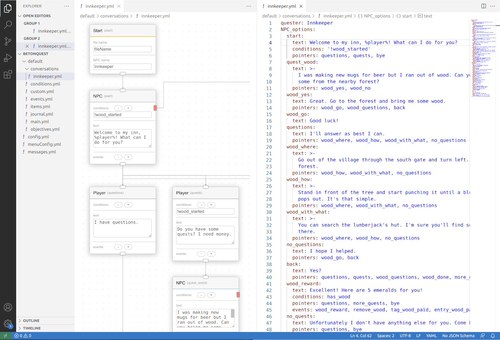

# BetonQuest Visual Editor

A GUI based editor for [BetonQuest 2.0](https://github.com/BetonQuest/BetonQuest) scripting.

## Features

- Edit `Conversations` with a interactive flowchart UI.
- (planning) Base `Events`, `Conditions`, `Objectives` Editors with fully [documentation](https://docs.betonquest.org/2.0-DEV/Documentation/Overview/) support.
- (planning) [Journal](https://docs.betonquest.org/2.0-DEV/Documentation/Features/Journal/) editing.
- (planning) [Items](https://docs.betonquest.org/2.0-DEV/Documentation/Features/Items/) editing.
- (planning) [Intergrated plugins](https://docs.betonquest.org/2.0-DEV/Documentation/Scripting/Building-Blocks/Integration-List/) support.
- (planning) Package configuration.
- (planning) [Menu](https://docs.betonquest.org/2.0-DEV/Documentation/Features/Menus/Menu/) editing.
- and more. Please [suggest](https://github.com/EverMCServer/vscode-BetonQuest).

## Limitations

- `Conversations` Editor does not support [cross-conversation pointers](https://docs.betonquest.org/2.0-DEV/Documentation/Features/Conversations/#cross-conversation-pointers) at this moment.

## Extension Settings

(Custom settings might come in the future.)

## Known Issues

Please report your issues on https://github.com/EverMCServer/vscode-BetonQuest

- Zoom-in and out is limited to certain degrees.
- Lines in Yaml files are re-ordered while editing.
- Original comments in Yaml files are erased while editing.

## Release Notes

### 0.0.1

- Initial Conversation's editor.
