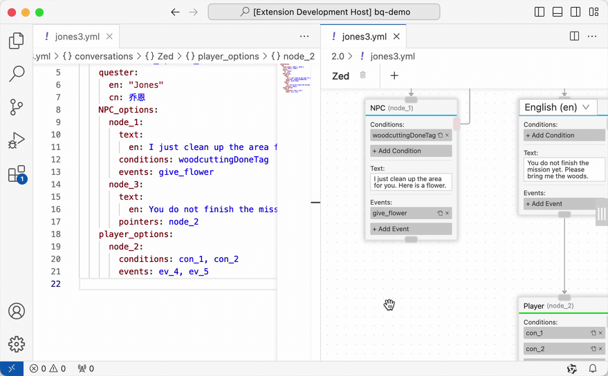

# BetonQuest Visual Editor

[](https://marketplace.visualstudio.com/items?itemName=EverMC.betonquest)
[](https://github.com/EverMCServer/vscode-BetonQuest/blob/main/LICENSE)


A GUI based editor for [BetonQuest](https://github.com/BetonQuest/BetonQuest) scripting.


## How to use

1. Download and install [VSCode](https://code.visualstudio.com/).
1. Install this extension from [VS Marketplace](https://marketplace.visualstudio.com/items?itemName=EverMC.betonquest).
1. Open the whole `BetonQuest` folder with VSCode.

## Showcase

### Edit `Conversations` with drag-and-drop:


### Build `Events` on click of a button:


### Locate `Conditions` has never been so easy:


### Theme:


## Feature Roadmap
- ✅ Web extension support. Just go to https://vscode.dev and try it.
- ✅ Edit `Conversations` with an interactive flowchart UI.
- ✅ The legacy **1.x file structure** \[[1](https://betonquest.org/1.12/User-Documentation/Reference/#packages)\] \[[2](https://betonquest.org/1.12/User-Documentation/Conversations/)\] support.
- ✅ The new **2.0 file structure** \[[1](https://betonquest.org/2.0/Documentation/Scripting/Packages-%26-Templates/)\] \[[2](https://betonquest.org/2.0/Tutorials/Syntax/Quest-Packages/)\] support.
- ✅ Formated `Events` Editors with built-in [documentation](https://betonquest.org/2.0/Documentation/Overview/) support.
- ✅ Formated `Conditions` Editors
- ✅ Formated `Objectives` Editors
- ✅ Formated `Events`, `Conditions`, `Objectives` Editors for the **1.x file structure**
- ✅ Supports [Variables](https://betonquest.org/2.0/Documentation/Scripting/Building-Blocks/Variables-List) in `Events`, `Conditions`, `Objectives` Editors.
- ✅ i18n support.
    - English
    - Simplified Chinese 简体中文
    - Japanese 日本語 (contributed by shanaOP [@dusty01534](https://github.com/dusty01534))
- ✅ Click and jump to the code / flowchart / editor.
- ⬜ Advanced Variable editor.
- ⬜ [Journal](https://betonquest.org/2.0/Documentation/Features/Journal/) editing.
- ⬜ [Items](https://betonquest.org/2.0/Documentation/Features/Items/) editing.
- ⬜ [Intergrated plugins](https://betonquest.org/2.0/Documentation/Scripting/Building-Blocks/Integration-List/) support.
- ⬜ Package configuration.
- ⬜ [Menu](https://betonquest.org/2.0/Documentation/Features/Menus/Menu/) editing.
- and more. Please [suggest](https://github.com/EverMCServer/vscode-BetonQuest/issues).
- ⬜ Code referencing with LSP. Click any Events, Condiitons or Objectives then jump to the definition.
- ⬜ [Global Variables](https://betonquest.org/2.0/Documentation/Scripting/Building-Blocks/Variables-List/#global-variables) support.

## Limitations

- `Conversations` Editor does not support [cross-conversation pointers](https://betonquest.org/2.0/Documentation/Features/Conversations/#cross-conversation-pointers) at this moment.
- [Global Variables](https://betonquest.org/2.0/Documentation/Scripting/Building-Blocks/Variables-List/#global-variables) conflict with this extension. Please consider convert your scripts before using this extension. Support for Global Variables may be added in the far future.

## Extension Settings

- Translation Selection - The translation selection for conversation flowchart. Default to 'en'.

## Known Issues

Please report your issues on https://github.com/EverMCServer/vscode-BetonQuest/issues

- Zoom-in and out is limited to certain degrees.
- (2.0 related) Conversation's tabs are not properly switched when clicked on the YAML file.
- (2.0 related) Conversation's tabs are switched to the first one when the YAML edited.
- `notify` Event is not fully supported at this moment.

## About Translations

Currently only English and Simplified Chinese are available. If you want to contribute your translation, here are the instructions:

1. [Fork this project](https://github.com/EverMCServer/vscode-BetonQuest/fork) and clone it down.

1. Search and install a [VSCode's Language Pack](https://code.visualstudio.com/docs/getstarted/locales) extension from the [marketplace](https://code.visualstudio.com/docs/editor/extension-marketplace) of which you want to translate. Then reload your VSCode.

1. There are only 3 files you need to change:

    - Copy `utils/src/i18n/data/en.json` to `utils/src/i18n/data/[locale_code].json` then translate it.

        The `[locale_code]` part is referer to the list [here](https://code.visualstudio.com/docs/getstarted/locales#_available-locales). If the locale contains a dash `-`, please convert it to an underscore `_`.

    - Copy `package.nls.json` to `package.nls.[locale-code].json` then translate it.

        This time you should not convert any dash to underscore.

    - Add new imports on `utils/src/i18n/i18n.ts`:

        ```typescript
        import en from './data/en.json';
        import zh_cn from './data/zh_cn.json';
        // ...
        import locale_code_with_underscore from './data/[locale_code_with_underscore].json'; // New

        // Translation table
        const translations: Map<string, TTranslation> = new Map([
            ["en", en as TTranslation],
            ["zh-cn", zh_cn as TTranslation],
            // ...
            ["[locale-code-with-dash]", locale_code_with_underscore as TTranslation], // New
        ]);

        // ...
        ```

1. If you want to test run the project. You need to install [Node.js](https://nodejs.org/en/download) and do `npm install`. After that just reload your VSCode then hit `F5`.

1. Push your codes

1. Submit a [Pull Request](https://github.com/EverMCServer/vscode-BetonQuest/pulls) onto the `main` branch. Once everything checked your work will be merged.

Helps on translating this extension are welcomed. Please consider submitting your Pull Request onto the repository. 🥺


## Release Notes

### 0.4.1

- Fully supports Japanese 日本語に完全対応 (contributed by shanaOP [@dusty01534](https://github.com/dusty01534))

### 0.4.0

- Add "goto" support, now you can jump between the code and the editor when clicking on an Events / Objectives / Conditions
- Adjust flowchart style to better suite VSCode's color theme
- Fix missing translation

### 0.3.0
- i18n supported!
- Fully supports Simplified Chinese 完全支持简体中文
- Optimize initial loading speed
- Minimize extension
- Removes the `thunder` option from the `weather` Event BetonQuest/BetonQuest/pull/2671

(For more detailes, please check [CHANGELOG.md](CHANGELOG.md))
