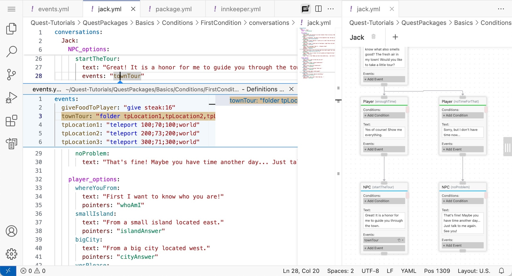

# BetonQuest Visual Editor

A GUI based editor for [BetonQuest 2.0](https://github.com/BetonQuest/BetonQuest) scripting.

## Features

### Conversations Editor

Edit `Conversations` with an interactive flowchart UI:

Create and link options with drag-and-drop:

### Feature Roadmap
- [x] Edit `Conversations` with an interactive flowchart UI.
- [ ] Basic `Events`, `Conditions`, `Objectives` Editors with fully [documentation](https://docs.betonquest.org/2.0-DEV/Documentation/Overview/) support.
- [ ] [Journal](https://docs.betonquest.org/2.0-DEV/Documentation/Features/Journal/) editing.
- [ ] [Items](https://docs.betonquest.org/2.0-DEV/Documentation/Features/Items/) editing.
- [ ] [Intergrated plugins](https://docs.betonquest.org/2.0-DEV/Documentation/Scripting/Building-Blocks/Integration-List/) support.
- [ ] Package configuration.
- [ ] [Menu](https://docs.betonquest.org/2.0-DEV/Documentation/Features/Menus/Menu/) editing.
- and more. Please [suggest](https://github.com/EverMCServer/vscode-BetonQuest/issues).

## Limitations

- `Conversations` Editor does not support [cross-conversation pointers](https://docs.betonquest.org/2.0-DEV/Documentation/Features/Conversations/#cross-conversation-pointers) at this moment.

## Extension Settings

- Translation Selection - The translation selection for conversation flowchart. Default to 'en'.

## Known Issues

Please report your issues on https://github.com/EverMCServer/vscode-BetonQuest/issues

- Zoom-in and out is limited to certain degrees.
- Lines in Yaml files are re-ordered while editing.
- Original comments in Yaml files are erased while editing.

## Release Notes

(For more detailes, please check [CHANGELOG.md](CHANGELOG.md))

### 0.0.8
- Conversation optiosn can now be fast-located with cursor on yaml documents
- Fix "Open Conversation Flowchart" button does not show up in Windows

### 0.0.7

- Various bugs fix

### 0.0.6

- Fix extension is not being activated when VSCode is started the first time

### 0.0.5

- Fix translation selection is reverted when switching between conversation editors

### 0.0.4

- Avoid flowchart flickering while editing YAML by delaying the docuemnt update
- Focus lost the first time typing
- Focus lost typing too fast

### 0.0.3

- Translation selection
- Configuration to set your default translation selection
- The Conversation Flowchart is now activated by the Text Editor's tool-bar which located on the top right corner

### 0.0.2

- Bug fixes

### 0.0.1

- Initial Conversation's editor
