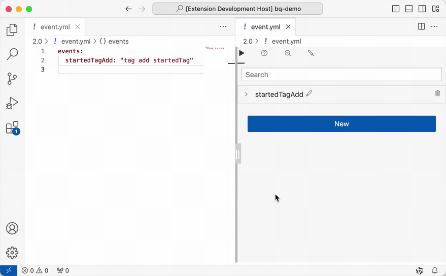

# BetonQuest Visual Editor

A GUI based editor for [BetonQuest 2.0](https://github.com/BetonQuest/BetonQuest) scripting.

## Features

### Edit `Conversations` with drag-and-drop:

### Build `Events` on click of a button:

### Feature Roadmap
- [x] Web extension support. Just go to https://vscode.dev and try it.
- [x] Edit `Conversations` with an interactive flowchart UI.
- [x] The legacy **1.x file structure** \[[1](https://docs.betonquest.org/1.12/User-Documentation/Reference/#packages)\] \[[2](https://docs.betonquest.org/1.12/User-Documentation/Conversations/)\] support.
- [x] The new **2.0 file structure** \[[1](https://docs.betonquest.org/2.0-DEV/Documentation/Scripting/Packages-%26-Templates/)\] \[[2](https://docs.betonquest.org/2.0-DEV/Tutorials/Syntax/Quest-Packages/)\] support.
- [x] Formated `Events` Editors with fully [documentation](https://docs.betonquest.org/2.0-DEV/Documentation/Overview/) support.
- [ ] Formated `Conditions` Editors
- [x] Formated `Objectives` Editors
- [ ] `Events`, `Conditions`, `Objectives` Editors for the **1.x file structure**
- [ ] [Journal](https://docs.betonquest.org/2.0-DEV/Documentation/Features/Journal/) editing.
- [ ] [Items](https://docs.betonquest.org/2.0-DEV/Documentation/Features/Items/) editing.
- [ ] [Intergrated plugins](https://docs.betonquest.org/2.0-DEV/Documentation/Scripting/Building-Blocks/Integration-List/) support.
- [ ] Package configuration.
- [ ] [Menu](https://docs.betonquest.org/2.0-DEV/Documentation/Features/Menus/Menu/) editing.
- and more. Please [suggest](https://github.com/EverMCServer/vscode-BetonQuest/issues).

## Limitations

- `Conversations` Editor does not support [cross-conversation pointers](https://docs.betonquest.org/2.0-DEV/Documentation/Features/Conversations/#cross-conversation-pointers) at this moment.
- `Events`, `Conditions`, `Objectives` Editors do not support the **1.x file structure** yet.

## Extension Settings

- Translation Selection - The translation selection for conversation flowchart. Default to 'en'.

## Known Issues

Please report your issues on https://github.com/EverMCServer/vscode-BetonQuest/issues

- Zoom-in and out is limited to certain degrees.
- (2.0 related) Conversation's tabs are not properly switched when clicked on the YAML file.
- (2.0 related) Conversation's tabs are switched to the first one when the YAML edited.
- `Events`, `Conditions`, `Objectives` Editor does not fully supprot [variables](https://docs.betonquest.org/2.0-DEV/Documentation/Scripting/Building-Blocks/Variables-List/). Loading arguments with variables might be rest to default values.

## Release Notes

### 0.2.1

- Objectives editing for 2.0! (1.0 is on the way)
- Fix various bugs on Events editing

### 0.2.0
- Events editing for 2.0! (1.0 is on the way)

### 0.1.6
- Suggest YAML extension pack for grammar chacking
- The extension is not activated under web envrionment
